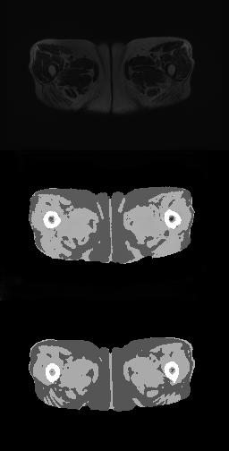

# cycle-GAN
cycle-GAN for medical image synthesis

A typical result would be:

Where the top is input, bottom is target and middle is the generated.

Since the medical data contains privacy, I cannot show the dataset.
